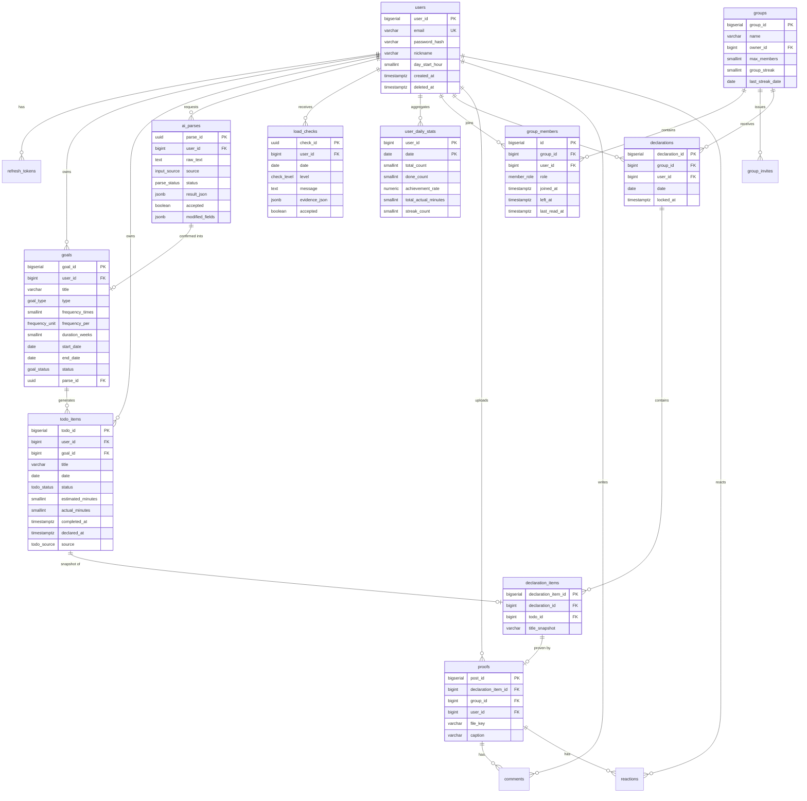

> 개척학기제 과제 · P들을 위한 TODO List 공유 어플
DBMS: PostgreSQL 15+ / API 명세 v1 대응
담당: 박영준 (DB & AI) · 확정 목표: 2주차(9/7~9/11)
> 

---

## 1. 전체 ERD



---

## 2. 설계 핵심 결정 4가지

### 2.1 Goal / TodoItem 분리

반복 목표("주 3회 운동, 4주")를 하나의 테이블로 처리하면 "이번 주 몇 번 했나"를 구할 때마다 문자열 파싱이 필요해진다. `goals`가 규칙을, `todo_items`가 실행 사실을 담는 구조로 나누면 달성률·페이스 계산이 전부 단순 집계 쿼리가 된다.

**중요**: `todo_items`는 미리 4주치를 만들어두지 **않는다**. 사용자가 제안을 수락한 시점에만 그날짜 행을 생성한다. 미리 생성하면 사용자가 목표를 수정할 때마다 미래 행을 지우고 다시 만들어야 하고, 삭제된 행이 통계에 섞인다.

### 2.2 선언 스냅샷 (`declaration_items.title_snapshot`)

선언된 투두의 제목을 그룹 기록에 **복사해서 저장**한다. 사용자가 나중에 원본 투두를 지우거나 제목을 바꿔도, 친구들이 본 선언 내용은 그대로 남아야 하기 때문이다. FK만 걸어두면 "어제 뭘 선언했는지"가 사라진다.

### 2.3 `todo_items.declared_at` 비정규화

선언 잠금(`422 DECLARED_TODO_LOCKED`) 판정은 투두를 수정할 때마다 발생한다. 매번 `declaration_items`를 조인하는 대신 `declared_at` 타임스탬프를 투두에 직접 찍는다. NULL이면 자유 수정, 값이 있으면 잠금.

### 2.4 `user_daily_stats` 집계 테이블

통계 페이지, 그룹 랭킹, 계획량 안내가 모두 "지난 14일 실행 기록"을 읽는다. 이걸 매번 `todo_items` 전체 스캔으로 계산하면 사용자가 늘수록 느려진다. 투두 완료·취소 시점에 해당 날짜 행만 갱신하는 방식으로 유지한다.

> 계획량 안내 기능의 "지난 2주간 한 시간 이상 걸리는 일을 두 개 넘게 끝낸 날은 이틀"은 이 테이블만으로는 안 나온다(작업 크기별 분해 필요). 이 쿼리만 `todo_items`를 직접 읽되, 14일 범위 + 사용자 단위라 부담이 없다.
> 

---

## 3. 테이블 상세

### 3.1 users

| 컬럼 | 타입 | 제약 | 설명 |
| --- | --- | --- | --- |
| user_id | bigserial | PK |  |
| email | varchar(255) | UNIQUE, NOT NULL |  |
| password_hash | varchar(255) | NOT NULL | bcrypt |
| nickname | varchar(30) | NOT NULL |  |
| profile_image_url | varchar(500) | NULL |  |
| day_start_hour | smallint | DEFAULT 4 | 하루 경계 (기본 04시) |
| created_at | timestamptz | DEFAULT now() |  |
| updated_at | timestamptz | DEFAULT now() |  |
| deleted_at | timestamptz | NULL | soft delete |

### 3.2 refresh_tokens

| 컬럼 | 타입 | 제약 |
| --- | --- | --- |
| token_id | bigserial | PK |
| user_id | bigint | FK → users, ON DELETE CASCADE |
| token_hash | varchar(255) | NOT NULL, INDEX |
| expires_at | timestamptz | NOT NULL |
| revoked_at | timestamptz | NULL |

> 토큰 원문이 아니라 해시를 저장한다. DB가 유출돼도 세션을 탈취당하지 않는다.
> 

### 3.3 goals

| 컬럼 | 타입 | 제약 | 설명 |
| --- | --- | --- | --- |
| goal_id | bigserial | PK |  |
| user_id | bigint | FK → users, NOT NULL |  |
| title | varchar(100) | NOT NULL |  |
| type | goal_type | NOT NULL | `single` / `recurring` |
| frequency_times | smallint | NULL | recurring일 때만 |
| frequency_per | frequency_unit | NULL | `week` / `month` |
| duration_weeks | smallint | NULL |  |
| start_date | date | NOT NULL |  |
| end_date | date | NULL | 생성 시 계산해 저장 |
| estimated_minutes | smallint | NULL | 1회 예상 소요 |
| status | goal_status | DEFAULT 'active' | `active`/`completed`/`abandoned` |
| parse_id | uuid | FK → ai_parses, NULL | AI 경유 여부 추적 |

**CHECK 제약**

```sql
CHECK (type = 'single' OR (frequency_times IS NOT NULL AND frequency_per IS NOT NULL))
CHECK (end_date IS NULL OR end_date >= start_date)
```

### 3.4 todo_items

| 컬럼 | 타입 | 제약 | 설명 |
| --- | --- | --- | --- |
| todo_id | bigserial | PK |  |
| user_id | bigint | FK → users, NOT NULL | 조회 성능용 비정규화 |
| goal_id | bigint | FK → goals, NULL | 단발 항목은 NULL |
| title | varchar(100) | NOT NULL |  |
| date | date | NOT NULL |  |
| status | todo_status | DEFAULT 'pending' | `pending`/`done`/`deferred`/`skipped` |
| estimated_minutes | smallint | NULL |  |
| actual_minutes | smallint | NULL | 완료 시 기록 |
| completed_at | timestamptz | NULL |  |
| declared_at | timestamptz | NULL | 값 있으면 수정 잠금 |
| display_order | smallint | DEFAULT 0 |  |
| source | todo_source | NOT NULL | `ai_suggested`/`manual`/`auto_scheduled` |
| deferred_from | date | NULL | 미룬 횟수 추적 |

### 3.5 ai_parses

| 컬럼 | 타입 | 설명 |
| --- | --- | --- |
| parse_id | uuid | PK, `gen_random_uuid()` |
| user_id | bigint | FK → users |
| raw_text | text | 원본 발화·입력 |
| source | input_source | `stt` / `text` |
| stt_confidence | numeric(3,2) | NULL |
| status | parse_status | `ok`/`partial`/`fallback` |
| result_json | jsonb | drafts 배열 원본 |
| model | varchar(50) | 모델명·버전 |
| latency_ms | integer |  |
| input_tokens / output_tokens | integer | 예산 추적용 |
| accepted | boolean | NULL = 미응답 |
| modified_fields | jsonb | 사용자가 고친 필드 목록 |

> **이 테이블이 최종보고서의 근거 데이터다.** 수락률, 필드별 수정 빈도, `status` 분포, 한국어 발화 유형별 정확도가 전부 여기서 나온다. 지우지 말 것.
> 

### 3.6 load_checks

| 컬럼 | 타입 | 설명 |
| --- | --- | --- |
| check_id | uuid | PK |
| user_id | bigint | FK → users |
| date | date | 판정 대상 날짜 |
| level | check_level | `ok` / `warning` |
| message | text | 안내 문구 |
| evidence_json | jsonb | 집계 근거 |
| suggestions_json | jsonb | 제안한 조정안 |
| accepted | boolean | NULL = 미응답 |
| applied_todo_ids | bigint[] | 실제 미룬 항목 |
| responded_at | timestamptz |  |

UNIQUE(user_id, date) — 하루 한 번만 판정하고 재조회 시 캐시된 결과를 반환한다.

### 3.7 user_daily_stats

| 컬럼 | 타입 | 설명 |
| --- | --- | --- |
| user_id | bigint | PK (복합) |
| date | date | PK (복합) |
| total_count | smallint | 그날 투두 수 |
| done_count | smallint | 완료 수 |
| achievement_rate | numeric(4,3) | 생성 컬럼 가능 |
| total_estimated_minutes | smallint |  |
| total_actual_minutes | smallint |  |
| heavy_done_count | smallint | 60분 이상 완료 수 (계획량 안내용) |
| streak_count | smallint | 그날 기준 연속 일수 |

### 3.8 groups

| 컬럼 | 타입 | 제약 |
| --- | --- | --- |
| group_id | bigserial | PK |
| name | varchar(50) | NOT NULL |
| owner_id | bigint | FK → users |
| max_members | smallint | DEFAULT 6, CHECK (max_members BETWEEN 3 AND 6) |
| group_streak | smallint | DEFAULT 0 |
| last_streak_date | date | NULL |
| deleted_at | timestamptz | NULL |

### 3.9 group_members

| 컬럼 | 타입 | 제약 |
| --- | --- | --- |
| id | bigserial | PK |
| group_id | bigint | FK → groups |
| user_id | bigint | FK → users |
| role | member_role | `owner` / `member` |
| joined_at | timestamptz | DEFAULT now() |
| left_at | timestamptz | NULL |
| last_read_at | timestamptz | 미확인 배지용 |

```sql
CREATE UNIQUE INDEX uq_group_active_member
  ON group_members (group_id, user_id) WHERE left_at IS NULL;
```

> 부분 유니크 인덱스를 쓰면 "탈퇴 후 재가입"이 가능하면서 중복 가입은 막힌다.
> 

### 3.10 group_invites

| 컬럼 | 타입 | 제약 |
| --- | --- | --- |
| invite_id | bigserial | PK |
| group_id | bigint | FK → groups |
| code | varchar(12) | UNIQUE, NOT NULL |
| created_by | bigint | FK → users |
| expires_at | timestamptz | NOT NULL (7일) |
| revoked_at | timestamptz | NULL |

### 3.11 declarations

| 컬럼 | 타입 | 제약 |
| --- | --- | --- |
| declaration_id | bigserial | PK |
| group_id | bigint | FK → groups |
| user_id | bigint | FK → users |
| date | date | NOT NULL |
| locked_at | timestamptz | NOT NULL (생성 즉시) |

UNIQUE(group_id, user_id, date) — `409 ALREADY_DECLARED`를 DB 레벨에서 보장한다.

### 3.12 declaration_items

| 컬럼 | 타입 | 제약 |
| --- | --- | --- |
| declaration_item_id | bigserial | PK |
| declaration_id | bigint | FK → declarations, CASCADE |
| todo_id | bigint | FK → todo_items, ON DELETE SET NULL |
| title_snapshot | varchar(100) | NOT NULL |

UNIQUE(declaration_id, todo_id)

### 3.13 proofs

| 컬럼 | 타입 | 제약 |
| --- | --- | --- |
| post_id | bigserial | PK |
| declaration_item_id | bigint | FK, **UNIQUE** (1항목 1인증) |
| group_id | bigint | FK → groups, 비정규화 |
| user_id | bigint | FK → users, 비정규화 |
| file_key | varchar(500) | NOT NULL |
| caption | varchar(200) | NULL |
| created_at | timestamptz |  |
| deleted_at | timestamptz | NULL |

> `group_id`·`user_id`를 중복 저장하는 이유: 피드 조회가 "그룹 + 날짜" 기준인데, 정규화를 지키면 `proofs → declaration_items → declarations`를 2단 조인해야 한다. 피드는 가장 자주 호출되는 API다.
> 

### 3.14 comments

| 컬럼 | 타입 |
| --- | --- |
| comment_id | bigserial PK |
| post_id | bigint FK → proofs, CASCADE |
| user_id | bigint FK → users |
| content | varchar(500) NOT NULL |
| created_at / deleted_at | timestamptz |

### 3.15 reactions

| 컬럼 | 타입 |
| --- | --- |
| reaction_id | bigserial PK |
| post_id | bigint FK → proofs, CASCADE |
| user_id | bigint FK → users |
| type | reaction_type (`fire`/`clap`/`heart`/`muscle`) |

UNIQUE(post_id, user_id) — 사용자당 1개, 변경은 UPSERT

---

## 4. 인덱스 목록

```sql
-- 가장 빈번한 쿼리: 오늘의 투두 조회
CREATE INDEX idx_todo_user_date ON todo_items (user_id, date)
  WHERE deleted_at IS NULL;

-- 목표별 진행률 집계
CREATE INDEX idx_todo_goal_status ON todo_items (goal_id, status)
  WHERE goal_id IS NOT NULL;

-- 계획량 안내: 최근 14일 완료 기록
CREATE INDEX idx_todo_completed ON todo_items (user_id, completed_at)
  WHERE status = 'done';

-- 진행 중 목표 목록
CREATE INDEX idx_goals_user_status ON goals (user_id, status)
  WHERE deleted_at IS NULL;

-- 그룹 피드 (커서 페이지네이션)
CREATE INDEX idx_proofs_group_created ON proofs (group_id, created_at DESC)
  WHERE deleted_at IS NULL;

-- 그룹 선언 현황
CREATE INDEX idx_decl_group_date ON declarations (group_id, date);

-- 내 그룹 목록
CREATE INDEX idx_member_user ON group_members (user_id) WHERE left_at IS NULL;

-- 통계·랭킹
CREATE INDEX idx_stats_user_date ON user_daily_stats (user_id, date DESC);

-- 초대 코드 조회
CREATE UNIQUE INDEX idx_invite_code ON group_invites (code);
```

---

## 5. ENUM 타입 정의

```sql
CREATE TYPE goal_type      AS ENUM ('single', 'recurring');
CREATE TYPE frequency_unit AS ENUM ('week', 'month');
CREATE TYPE goal_status    AS ENUM ('active', 'completed', 'abandoned');
CREATE TYPE todo_status    AS ENUM ('pending', 'done', 'deferred', 'skipped');
CREATE TYPE todo_source    AS ENUM ('ai_suggested', 'manual', 'auto_scheduled');
CREATE TYPE input_source   AS ENUM ('stt', 'text');
CREATE TYPE parse_status   AS ENUM ('ok', 'partial', 'fallback');
CREATE TYPE check_level    AS ENUM ('ok', 'warning');
CREATE TYPE member_role    AS ENUM ('owner', 'member');
CREATE TYPE reaction_type  AS ENUM ('fire', 'clap', 'heart', 'muscle');
```

> ENUM은 값 추가는 쉽지만 삭제·변경이 번거롭다. 리액션 종류처럼 나중에 늘어날 가능성이 있으면 `varchar` + CHECK도 무방하다. 팀 취향에 맞춰 2주차에 결정.
> 

---

## 6. 주요 쿼리 3종

### 6.1 오늘의 제안 (`GET /todos/suggestions`)

이번 주 페이스가 부족한 진행 중 목표를 찾는다.

```sql
SELECT g.goal_id, g.title, g.frequency_times, g.estimated_minutes,
       COUNT(t.todo_id) FILTER (WHERE t.status = 'done') AS week_done
FROM goals g
LEFT JOIN todo_items t
  ON t.goal_id = g.goal_id
 AND t.date BETWEEN :week_start AND :week_end
WHERE g.user_id = :user_id
  AND g.status = 'active'
  AND g.type = 'recurring'
  AND :today BETWEEN g.start_date AND g.end_date
  AND NOT EXISTS (
    SELECT 1 FROM todo_items x
    WHERE x.goal_id = g.goal_id AND x.date = :today
  )
GROUP BY g.goal_id
HAVING COUNT(t.todo_id) FILTER (WHERE t.status = 'done') < g.frequency_times;
```

### 6.2 계획량 안내 근거 (`GET /ai/load-check`)

```sql
SELECT COUNT(*) AS days_with_3plus_heavy
FROM (
  SELECT date, COUNT(*) AS heavy
  FROM todo_items
  WHERE user_id = :user_id
    AND status = 'done'
    AND estimated_minutes >= 60
    AND date BETWEEN :today - 14 AND :today - 1
  GROUP BY date
) d
WHERE d.heavy >= 3;
```

### 6.3 그룹 스트릭 판정 (일 1회 배치)

선언한 멤버 전원이 선언 항목을 100% 완료한 날만 +1.

```sql
SELECT NOT EXISTS (
  SELECT 1
  FROM declarations d
  JOIN declaration_items di ON di.declaration_id = d.declaration_id
  JOIN todo_items t ON t.todo_id = di.todo_id
  WHERE d.group_id = :group_id
    AND d.date = :target_date
    AND t.status <> 'done'
) AND EXISTS (
  SELECT 1 FROM declarations WHERE group_id = :group_id AND date = :target_date
) AS streak_success;
```

---

## 7. 개발 순서 (추진일정 대응)

| 주차 | 생성 테이블 |
| --- | --- |
| 3주 | (스키마 확정 및 마이그레이션 도구 세팅) |
| 4주 | `users`, `refresh_tokens` |
| 5주 | `goals` |
| 6주 | `todo_items`, `ai_parses` |
| 10주 | `load_checks`, `user_daily_stats` |
| 12주 | `groups`, `group_members`, `group_invites`, `declarations`, `declaration_items`, `proofs` |
| 13주 | `comments`, `reactions` |

> 마이그레이션은 Alembic을 권한다. 3명이 각자 DB를 띄우는 구조라 스키마 변경 전파 수단이 없으면 통합 때마다 막힌다.
> 

---

## 8. 2주차 회의 결정 사항

1. **`user_daily_stats` 갱신 방식** — 완료 시점 즉시 반영 vs. 하루 1회 배치. 즉시 반영이 구현은 쉽고 정합성 관리가 어렵다.
2. **인증샷 보관** — `file_key`만 저장하고 실제 파일은 30일 후 삭제할지. 삭제 시 `proofs` 행은 남기고 이미지만 만료 처리.
3. **ENUM vs varchar+CHECK** — 리액션 타입처럼 변동 가능성 있는 필드.
4. **soft delete 범위** — 전 테이블 적용은 쿼리마다 조건이 붙어 번거롭다. `users`·`goals`·`todo_items`·`proofs`·`comments`로 한정 권장.
5. **`user_id` 비정규화 허용 범위** — `todo_items`, `proofs`에 이미 적용했다. 추가할 곳이 있는지.